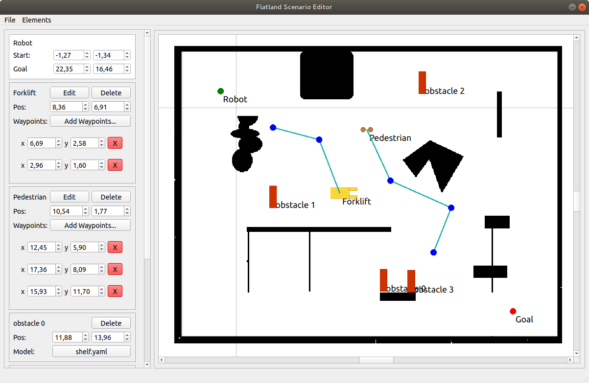
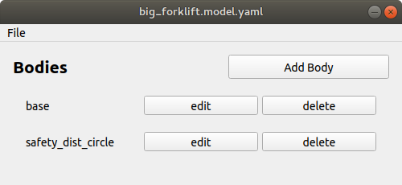
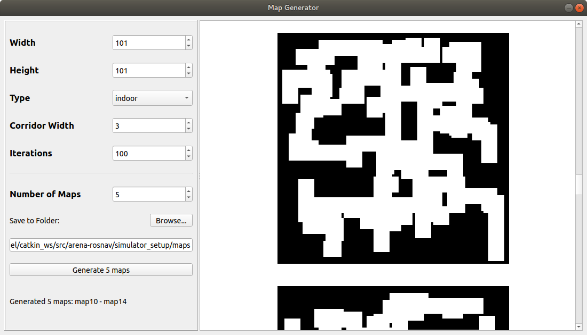

# arena-tools
A collection of tools to make working with [Arena-Rosnav](https://github.com/ignc-research/arena-rosnav/) easier. It currently includes:
- Scenario Editor
- Flatland Model Editor
- Map Generator

## Prerequisites
- Python 3.6 or higher

## Installation
Install Python packages:
```
pip3 install pyqt5 numpy pyyaml
```
## Run
```
python arena_tools.py
```


# Scenario Editor

Scenario Editor is a tool to create scenarios for use in Arena-Rosnav. Run it using Python:
```
python ArenaScenarioEditor.py
```

## Load and Save Scenarios
Click on File->Open or File->Save. Scenarios can be saved in YAML or JSON format, just use the according file ending.
## Set Scenario Map
Click on Elements->Set Map. Select a map.yaml file in the format of a typical ROS map (see [map_server Docs](http://wiki.ros.org/map_server#YAML_format)). The map will be loaded into the scene. You can drag the scene around using left mouse button and zoom in and out using scroll wheel.

## Set Robot initial position and goal
Robot position and goal is always part of a scenario. Position them by dragging the red and green circle to the desired position.

## Add Pedsim Agents

https://user-images.githubusercontent.com/74921738/126493822-88e94f7b-3595-4cce-93cd-df3a8a664607.mov


- Click on Elements->Add Pedsim Agent. An agent widget will be added on the left and the default Flatland Model for Pedsim Agents will be added to the scene.
- Drag the model around to position it in the scene.
- Open the Pedsim Agent Editor by clicking on Edit or double click the model in the scene. Here you can set the Flatland Model, type and all other attributes of your agent.
- Click on 'Add Waypoints...' to enter Waypoint Mode. Click anywhere in the scene to add a waypoint for this agent. Press ESC or click OK when finished.
- Move a waypoint by dragging it in the scene.
- Delete a waypoint by clicking on the red X or by selecting it in the scene and  hitting DELETE on your keyboard.
- Delete the agent by clicking on Delete or by selecting it in the scene and hitting DELETE on your keyboard.

## Add Flatland Object (Static Obstacle)


https://user-images.githubusercontent.com/74921738/126516348-d2c4ab92-fb8b-4b57-9a4f-3bdefeb9e665.mov


https://user-images.githubusercontent.com/74921738/127176906-98ab58bb-9c40-4d56-b65e-049072f45a5d.mov


- Click on Elements->Add Flatland Object. A widget will be added on the left and the default Flatland Model for objects will be added to the scene.
- Choose a model YAML file by clicking on the button in the widget
- Drag the model around to position it in the scene.
- Delete the object by clicking on Delete or by selecting it in the scene and hitting DELETE on your keyboard.
- Rotate object by holding CTRL while clicking on the object (keep mouse button pressed) and dragging the mouse.

# Flatland Model Editor


Flatland Model Editor is a tool to create models used by Flatland. See the [Flatland Documentation](https://flatland-simulator.readthedocs.io/en/latest/core_functions/models.html) for a description of a model file. Run it using Python:
```
python FlatlandModelEditor.py
```
## Load and Save Models
Click on File->Open or File->Save.
## Add Bodies
Click on 'Add Body'.
## Flatland Body Editor


https://user-images.githubusercontent.com/74921738/126547646-d491a712-a2d7-4881-940a-81134da04555.mov


Click on the 'edit'-Button of the Body you want to edit. The Flatland Body Editor will open. You can edit basic properties of the body and add polygon and circle footprints. You can drag the scene around using left mouse button and zoom in and out using scroll wheel.
### Polygon Footprints:
- Click on 'Add Polygon' to add a polygon footprint. A Footprint widget will be added on the left.
- Delete polygon footprint by clicking on delete.
- Edit the layers by writing them in the layers edit box. Layer names need to be separated by commas (e.g. like this: "layer1, layer2, layer3").
- Increase or decrease the number of vertices by clicking on + or -.
- Set position of the footprint by dragging it around in the scene.
- Set position of each vertice by holding the mouse near the vertice (cursor should change) and dragging the vertice.
- Duplicate footprint by selecting it in the scene and then pressing SHIFT + D
- Save body by clicking 'Save and Close'
### Circle Footprints
Not yet implemented.

# Map Generator


Map Generator is a tool to generate random ROS maps. Run it using Python:
```
python MapGenerator.py
```
## Notes
- Maps can be either an indoor or an outdoor type map. For **indoor** maps you can adjust the **Corridor With** and number of **Iterations**. For **outdoor** maps you can adjust the number of **Obstacles** and the **Obstacle Extra Radius**.
- Generate maps in bulk by setting **Number of Maps**
- Each map will be saved in its own folder. Folders will be named like "map[number]". [number] will be incremented starting from the highest number that already exists in the folder, so as not to overwrite any existing maps.
